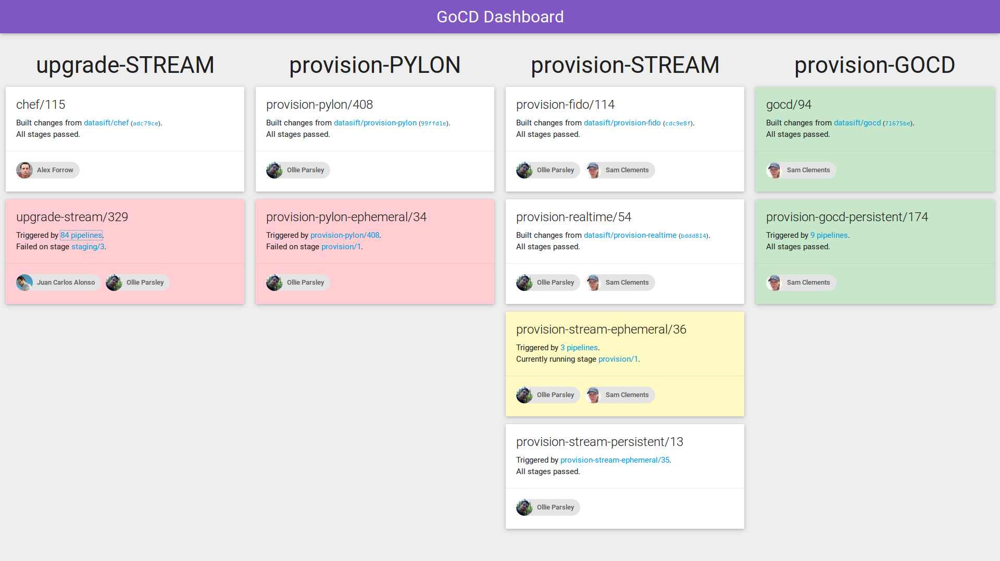

gocd-dashboard
==============

A [GoCD] dashboard for showing pipeline status at a glance. Details about each
pipeline and all of it's materials (even grandparents!) are collected to show
the authors of commits that caused each pipeline to run.



Usage
-----

_Requirements: Python 3.3 or above, the `gocd_dashboard` python package (and
it's dependencies)._

```bash
gocd-dashboard run --host localhost --port 5000
```

You will need to create a JSON configuration file that describes your GoCD
server. The server will look `config.json` in the current directory, or use the
path of the `GOCD_DASHBOARD_CONFIG` environment variable.

```json
{
  "gocd": {
    "server": "https://gocd.example.com",
    "username": "guest",
    "password": "guest"
  },
  "groups": [
    {
      "name": "example",
      "pipelines": [
        "pipeline-a",
        "pipeline-b"
      ]
    }
  ]
}
```

Pipelines will be colored depending on their status:

- Failed: red.
- Running: yellow.
- Passed: white (green if the entire group has passed).

Development
-----------

_Requirements: Python 3.3 or above, the `virtualenv` python package, NodeJS
and the `npm` package manager._

Install the module into a Python virtualenv in development mode:

```bash
pip install -e .
```

Install a [Sass] compiler and [materialize.css]:

```bash
npm install
```

Compile CSS files using `node-sass`:

```bash
./node_modules/.bin/node-sass --watch gocd_dashboard/static --output gocd_dashboard/static
```

Run the development server:

```bash
FLASK_DEBUG=1 gocd-dashboard run
```

License
-------

Released under the MIT licence. See [LICENSE](./LICENSE). 

Authors
-------

- [Sam Clements]

[GoCD]: https://www.go.cd/
[materialize.css]: http://materializecss.com/
[Sam Clements]: https://github.com/borntyping/
[Sass]: http://sass-lang.com/
